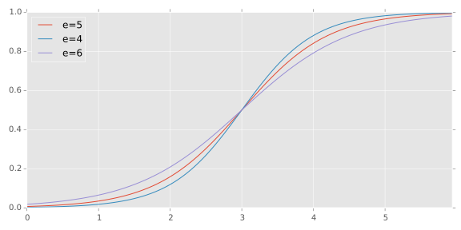

# Obstructures numeric wallet model

This model attempot sto optimize the placement of the bands in the new A4
wallet. It relates the position of the lower band (not the new -120 band)
to both ‘security’ and ‘ease of operation’.

The Equations

Security as modelled as a ‘risk factor’ between 0 and 1 based on the lateral
position of a card beneath the bands.

When squarely situated on the wallet, this security factor = 1. When
underneath no bands, it equals 0. Along the x-axis, 0 represents the bottom
edge of the card, the break in the graph at .5 is the lower band, 1.55 the
upper band, and 2.125 the other edge of the card.

There’s a point on the y-axis (a) at which it goes from being underneath
two bands to being under only one. This difference (or ratio) between
security is unknown and varies in the model between 0.1 and 0.9. A lower
number suggests that the contents are much more secure when under both bands.
A higher number suggests little change in security as long as the contents
are under at least one band.

As the bottom edge of the card moves towards the lower band, security
decreases. The ‘kink’ represents the card slipping under the lower band.
As it slides toward the upper band, security further decreases. At 0, the
card has slipped under the upper band and is no longer secured. The point
at which security = 0 to the right edge of the graph represents the top edge
of the card. This is poorly thought out and needs revision.

Then there’s the decay rate (r)—how fast the security factor decreases as
the card slides toward a band. This is also variable, with a higher rate
meaning security drops at a more even rate (approaching a straight line)
and a lower rate meaning that theres little change at first and the change
increases more rapidly over time. I’m assuming a very basic exponential
decay function, and the realities are likely much more complex. But these
are the limits of modelling. Or at least the limits of my skill.

Ease.

We assume that a basic sigmoid curve describes the relationship of strain
and stress of the o-rings (which is common amongst rubber compounds). We
assume it runs from 0% stretch to 600% stretch, the hypothetical point
of failure based on datasheets from the manufacturer of our compound.

Like security, the ‘rate’ of this curve (e) is unknown and varies in the
model. Changing it can cause the curve to be flatter at the ends and steeper
through the middle, or more uniform throughout.

The model calculates, roughly, the decreasing amount of stretch caused by
moving the lower band closer to the wallet’s edge (“Food-eater!”). Then
translates this value to the sigmoid curve. Obviously the less the stretch,
the lower the value of the curve.

The objective.

The graphs of each of these variable is translated onto a 1 by 1 graph,
and the area underneath the curve is calculated. In other words, maximum
security would fill the graph and its area would equal 1. Maximum ease
would also equal 1.

Currently the objective function weights these values to prefer security
over ease. The value of the weighting constant also varies and can be
further dialed in, perhaps even preferring ease over security.